# Phantom manager installation guide
このドキュメントは、PhantomManager を Windows 上でセットアップするための手順を説明します。

## 1. 必要なOS、アプリケーション
- Windows 10 / 11
- Docker Desktop for Windows
- Windows WSL2

### 1.1 Docker Desktop のインストール
Docker Desktop をダウンロードしてインストールします。
配布元 [Docker Desktop for Windows](https://docs.docker.com/desktop/setup/install/windows-install/)

ダウンロードしたインストーラーをダブルクリックしてください。

そのまま 「OK」

インストールが始まる

インストールが終わる。「Close and restart」をクリックしてパソコンを再起動する。

### 1.2 Docker Desktop の初期設定
デスクトップに Docker Desktop for Windows のアイコンがあるのでダブルクリックして起動する。

記載事項に承諾するなら「Accept」

メールアドレスを登録するかgoogleなどのアカウントでサインイン、またはSkip

このような画面になれば初期設定完了

もし、「WSL needs updating」と表示されたら、「Try Again」をクリックする。

このような画面がでるので、Enterキーなど押す。

「はい」

セットアップが始まる。のこのようになるまで待つ。

## 2. Phantom Manager の前準備
### 2.1 Phantom Manager のダウンロード
[Phantom manager配布サイト](https://github.com/hyperion13th144m/phantom-manager/releases)
phantom-manager-vx.y.z-win-x64.zipを入手します。x.y.z はバージョン番号です。最新版を入手してください。

そのファイルをダブルクリックします。「全て展開」をクリックします。
ファイルを保存するフォルダを選択する画面が現れるので、適当なフォルダを選択する。

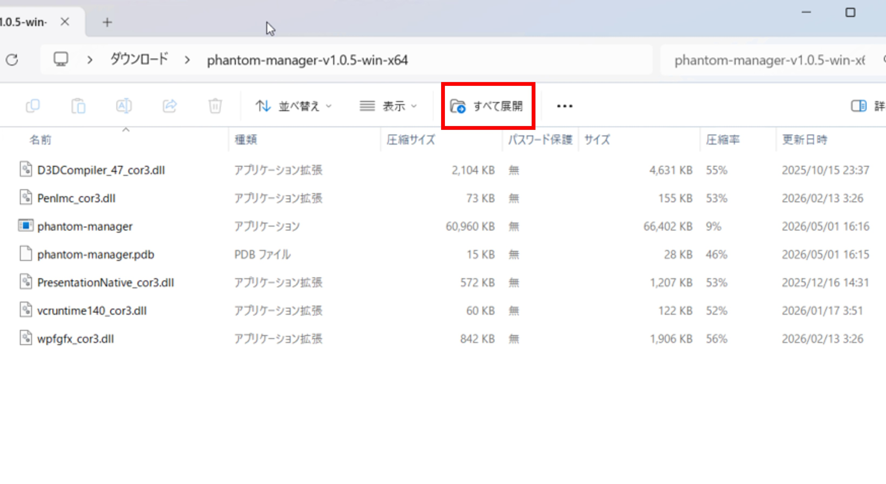

### 2.2 WSL のセットアップ
「wsl-install.bat」というファイルがあるのでダブルクリックする。

次のような画面が現れるので、ユーザ名、パスワードを入力する。
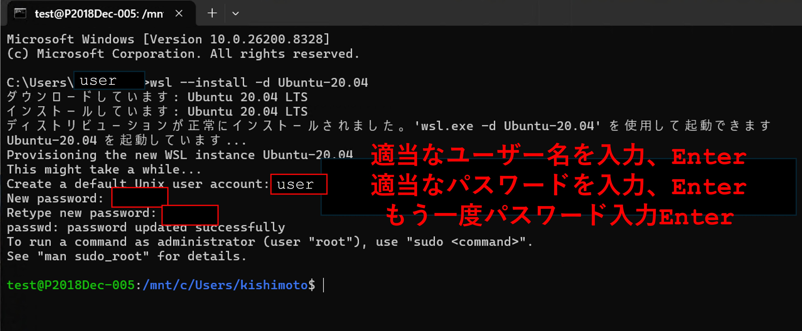

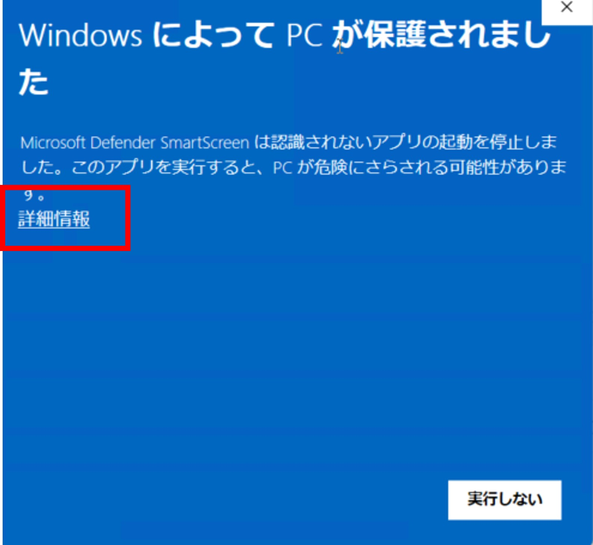
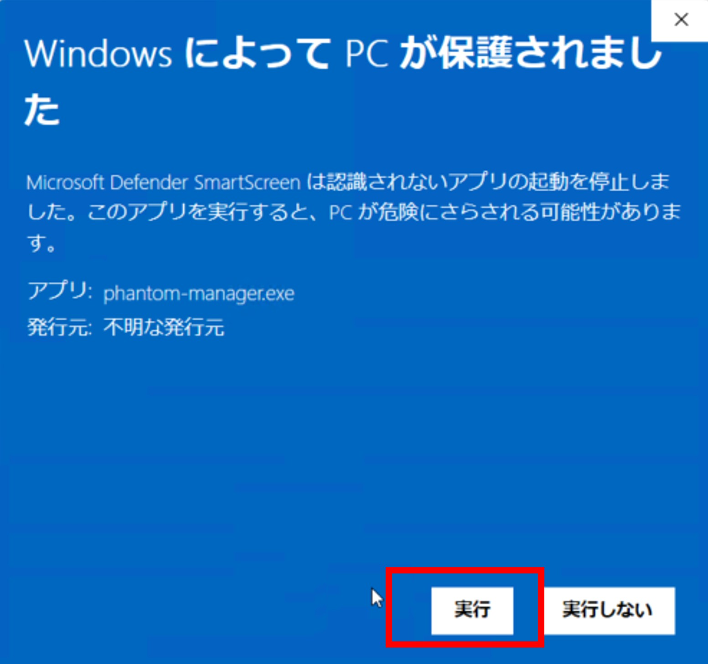

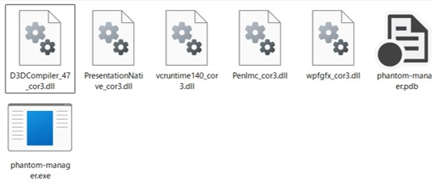

## 3. Phantom Manager の起動, 初期設定
### 3.1 Phantom Manager の起動
展開したフォルダ内の `phantom-manager.exe` をダブルクリックして起動します。

次のようなウィンドウが表示されるはずです。
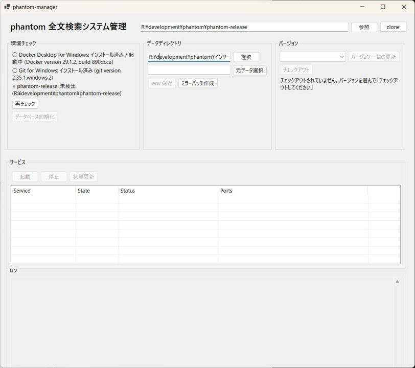

上記ウィンドウは、R:\development\phantom フォルダに phantom-manager.exe を配置した場合ですが、あなたの環境にあわせて異なるフォルダ名が表示されています。

### 3.2 全文検索システムのダウンロード
画面右上の `Clone` ボタンを押すと、全文検索システムがダウンロードされます。
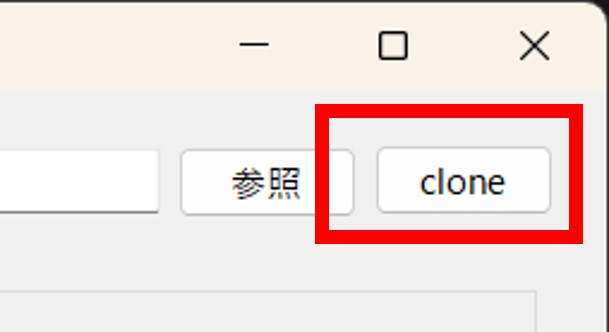

ダウンロードが完了すると、次のような表示になります。
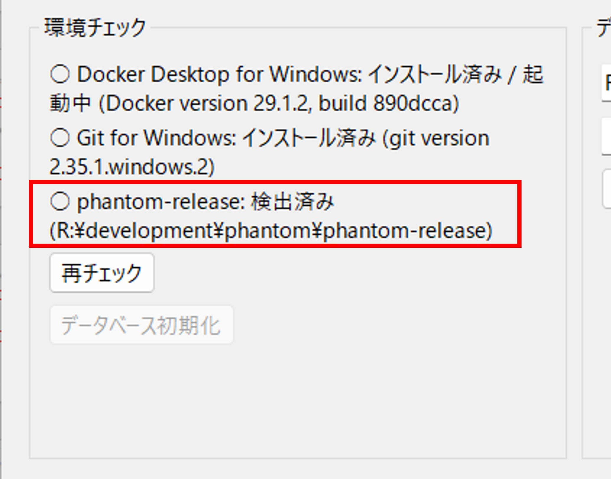

### 3.3 全文検索システムのバージョン設定
画面右側の「バージョンの更新」をクリックしてください。
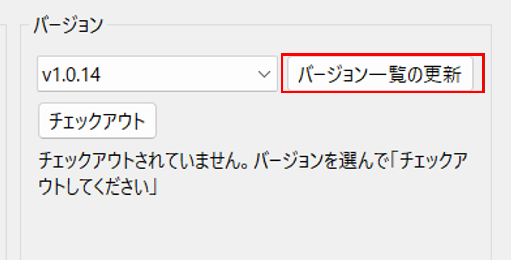

その後、左側のプルダウンからバージョンを選択できます。
一番上の最新（2026年4月25日現在は、v1.0.14）を選択し、「チェックアウト」ボタンをクリックしてください。
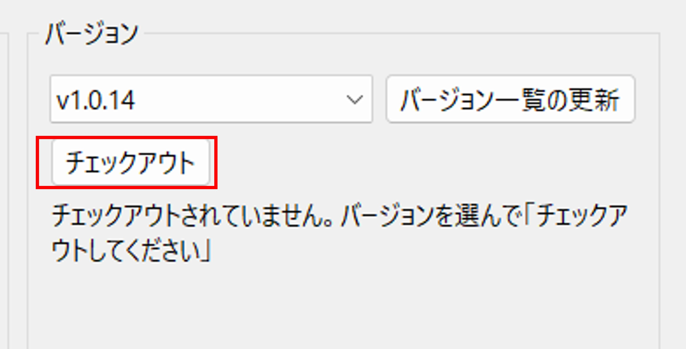

バージョン設定されると、次のような表示になります。
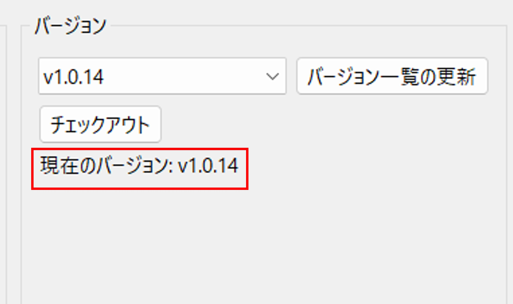

### 3.4 設定ファイルの生成
画面中央のデータディレクトリ付近にある「env 保存」をクリックしてください。

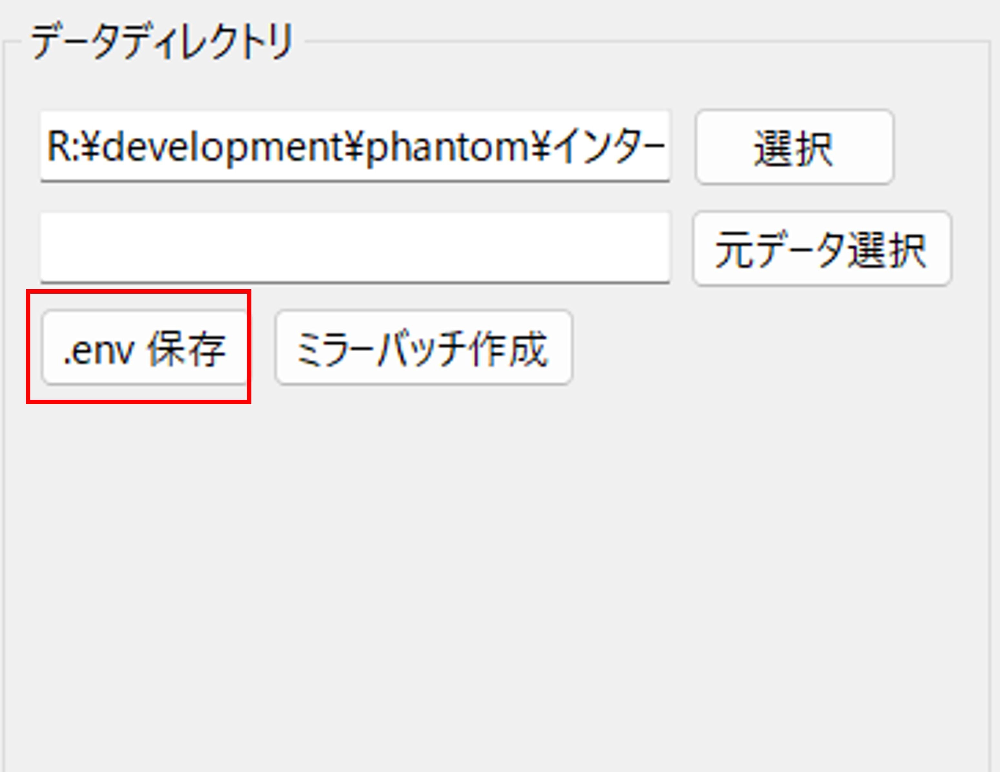

## 4. 取り込むデータの準備
本システムに取り込むインターネット出願ソフトのデータを「インターネット出願ソフトのデータ」というフォルダにコピーしてください。

手動か半自動でコピーできます。手動の場合は、4.1～4.2の手順に従ってください。半自動の場合は、4.3の手順に従ってください。

### 4.1 コピー先
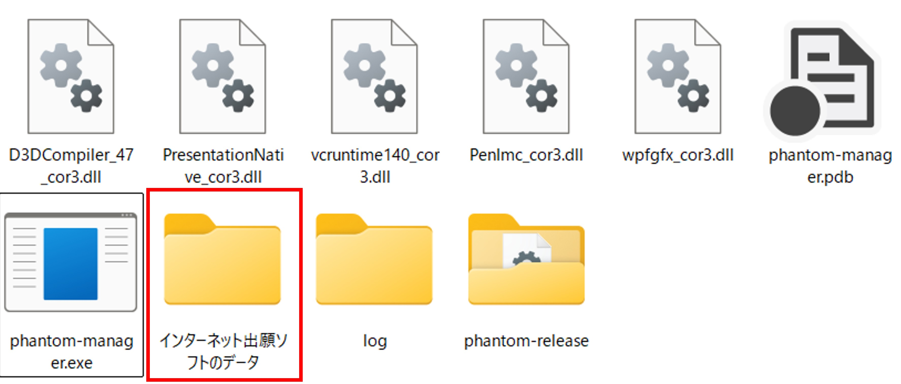

### 4.2 コピーするデータ
インターネット出願ソフトのデータは、通常、「CドライブのJPODATAフォルダ」に保存される。

APPL.JP1か、J05で終わるフォルダを適当に選んで「インターネット出願ソフトのデータ」フォルダにコピーしてください。

NOTICE.JP1 まるごとか、発送書類を受け取った日付のフォルダを適当に選んで「インターネット出願ソフトのデータ」フォルダにコピーしてください。

### 4.3 半自動でのコピー
インターネット出願ソフトのデータが保存されているフォルダを指定します。ネットワークドライブでもOKです。

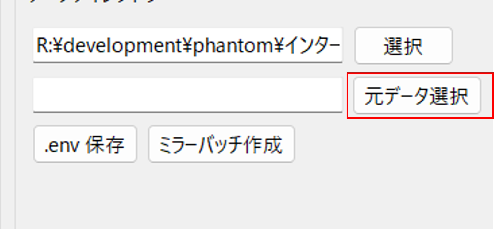

選択したフォルダが表示されていることを確認してください。図では、C:\JPODATA を選択しています。その後、「ミラーバッチ作成」をクリックしてください。
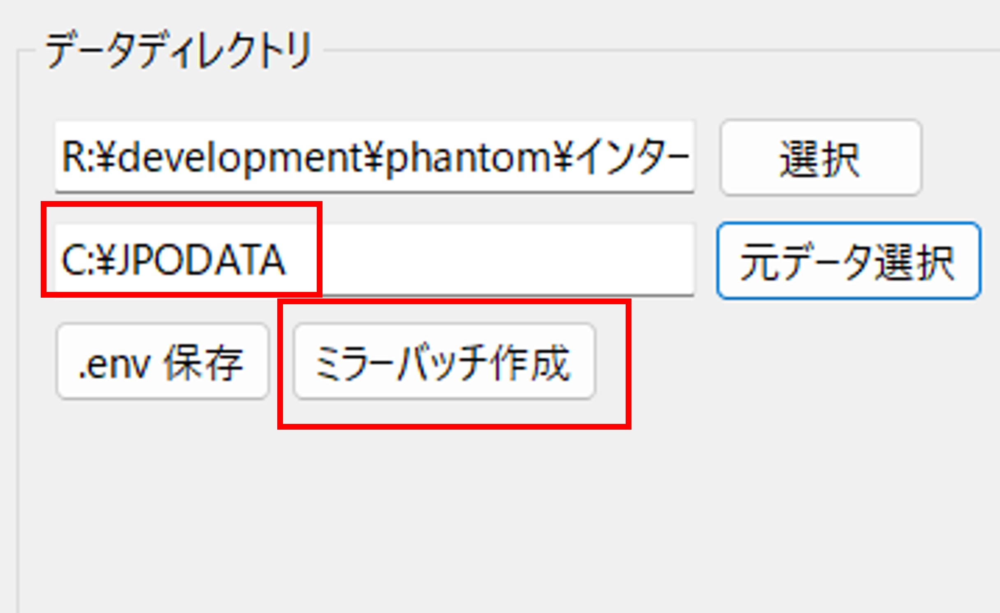

「bat」フォルダに、「mirror.bat」というファイルが生成されます。

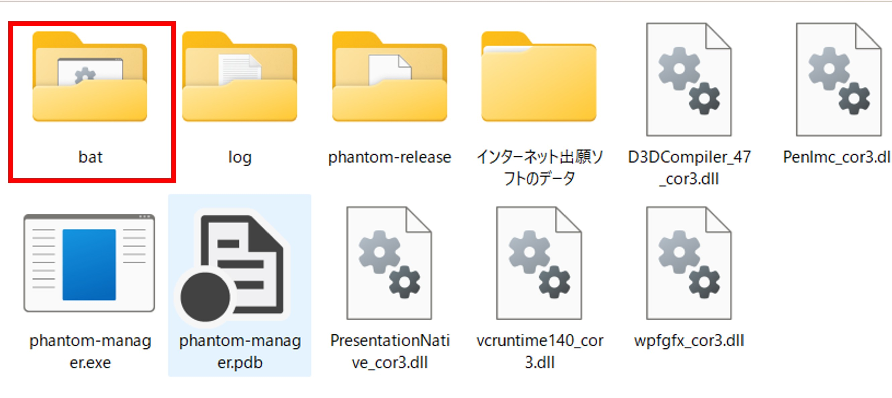
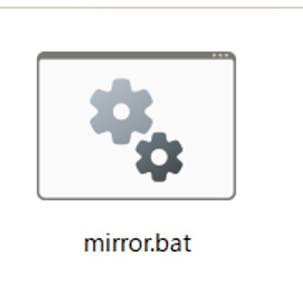

この「mirror.bat」をダブルクリックして実行してください。これで、インターネット出願ソフトのデータが「インターネット出願ソフトのデータ」フォルダにコピーされます。
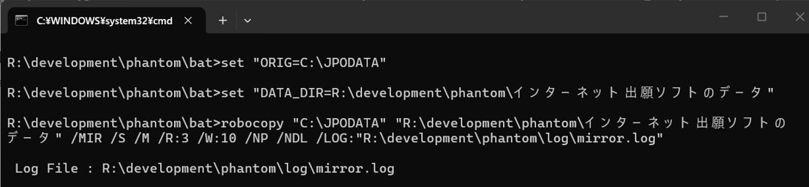

コピーが完了すると自動的に画面は消えます。log フォルダにmirror.log というファイルが生成されていることを確認してください。

インターネット出願ソフトのデータが増えた場合でも「mirror.bat」を再度実行することで、最新のデータをコピーできます。

## 5. サーバー起動
### 5.1 起動
「起動」ボタンをクリックしてください。
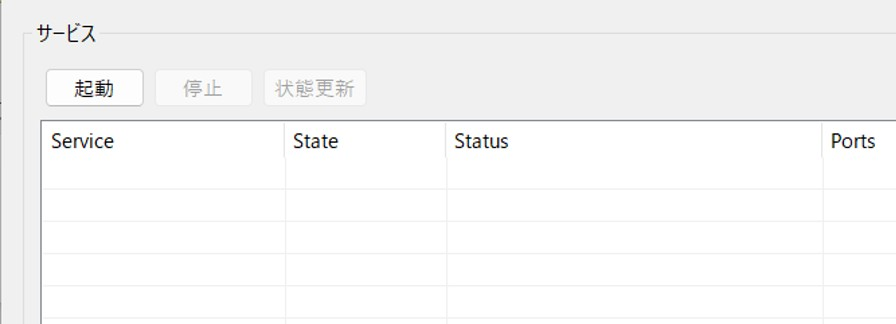

### 5.2 起動後の表示
起動後、次のような表示になります。
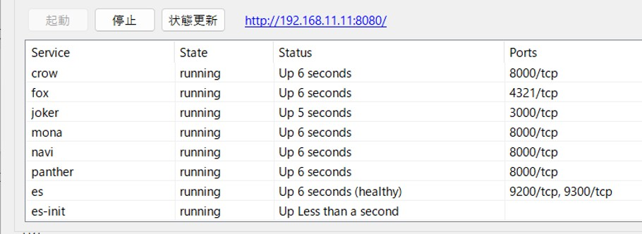
http://... のリンクをクリックすると、ブラウザで全文検索システムが表示されます。

### 5.3 停止
「停止」ボタンをクリックすると、サーバーが停止します。

## 6. 運用
ブラウザに「管理画面」が表示されます。「crow の管理画面へ」→「ALL」を選択して、「ジョブ開始」すると、「インターネット出願ソフトのデータ」フォルダにコピーしたデータがデータベースに取り込まれます。

適宜、↓を繰り返してください。
- 大元のインターネット出願ソフトのデータが増えたら、手動コピーor mirro.bat を実行
- crow ⇒ ALL ⇒ ジョブ開始
