# Phantom manager installation guide
このドキュメントは、PhantomManager を Windows 上でセットアップするための手順を説明します。

## 1. 必要なOS、アプリケーション
- Windows 10 / 11
- Docker Desktop for Windows
- Windows WSL2

### 1.1 Docker Desktop のインストール
Docker Desktop をダウンロードしてインストールします。
配布元 [Docker Desktop for Windows](https://docs.docker.com/desktop/setup/install/windows-install/)

ダウンロードしたインストーラーをダブルクリックしてください。

そのまま 「OK」

インストールが始まる

インストールが終わる。「Close and restart」をクリックしてパソコンを再起動する。

### 1.2 Docker Desktop の初期設定
デスクトップに Docker Desktop for Windows のアイコンがあるのでダブルクリックして起動する。

記載事項に承諾するなら「Accept」

メールアドレスを登録するかgoogleなどのアカウントでサインイン、またはSkip

このような画面になれば初期設定完了

もし、「WSL needs updating」と表示されたら、「Try Again」をクリックする。

このような画面がでるので、Enterキーなど押す。

「はい」

セットアップが始まる。のこのようになるまで待つ。

## 2. Phantom Manager のインストール・設定
### 2.1 Phantom Manager のダウンロード
[Phantom manager配布サイト](https://github.com/hyperion13th144m/phantom-manager/releases)
phantom-manager-vx.y.z-win-x64.zipを入手します。x.y.z はバージョン番号です。最新版を入手してください。

そのファイルをダブルクリックします。「全て展開」をクリックします。
ファイルを保存するフォルダを選択する画面が現れるので、適当なフォルダを選択する。

### 2.2 WSL のセットアップ
「wsl-install.bat」というファイルがあるのでダブルクリックする。

次のような画面が現れるので、ユーザ名、パスワードを入力する。

## 3. Phantom Manager の起動, 初期設定
### 3.1 Phantom Manager の起動
フォルダ内の `phantom-manager.exe` をダブルクリックして起動します。

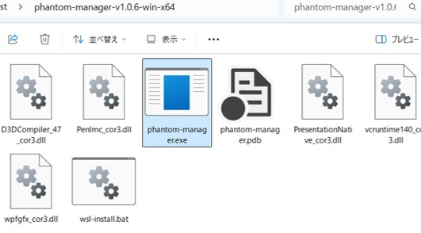

警告がでます。「詳細情報」

「実行」

### 3.2 確認
画面左上「環境チェック」で次の項目に○があることを確認してください。バージョン番号は違っていてもよいです。

- ○ Docker Desktop for Windows: インストール済み / ○ 起動中
    - もし × なら Docker Desktop for Windows をインストール/起動してください。
- ○ Git in Ubuntu-20.04: インストール済み
    - もし × なら 「2.2 WSLのセットアップ」 が未実行の可能性があります。
- ○ WSL Ubuntu-20.04:インストール済み
    - もし × なら 「2.2 WSLのセットアップ」 が未実行の可能性があります。

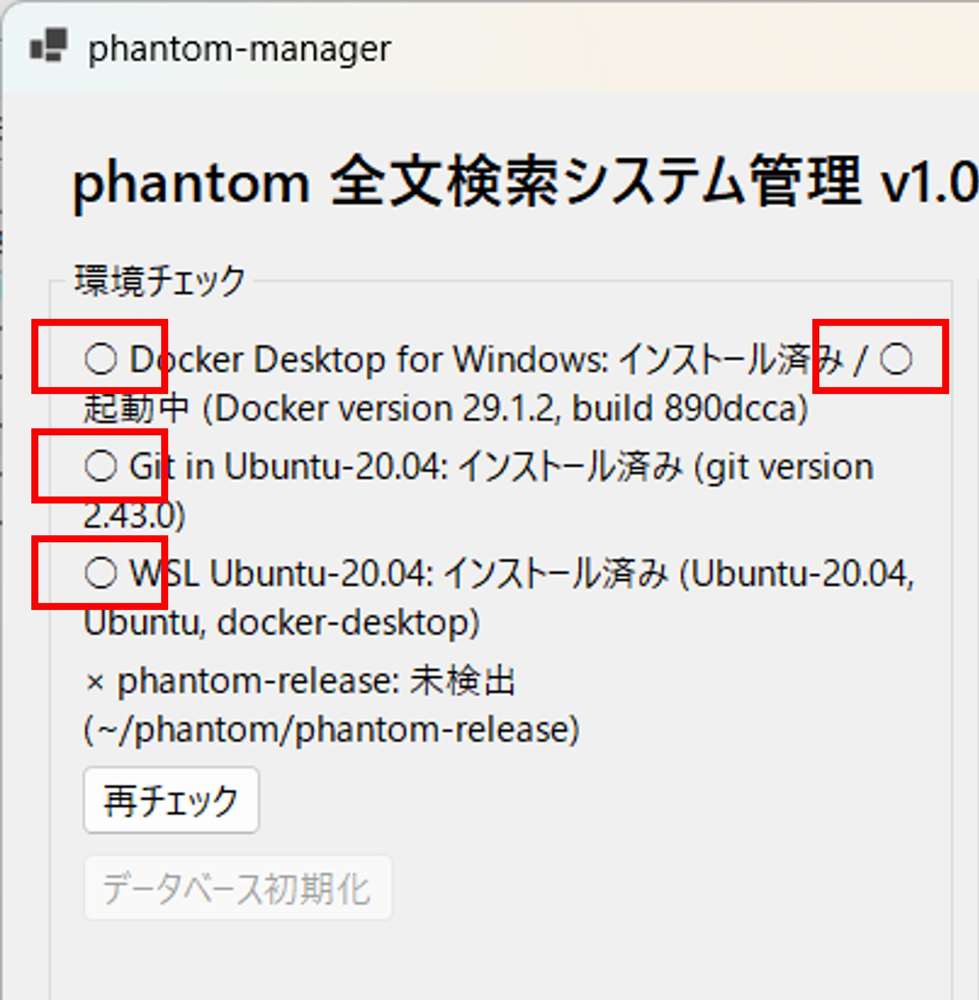

### 3.3 初期設定
画面中央上の `Clone` ボタンを押すと、全文検索システムがダウンロードされます。

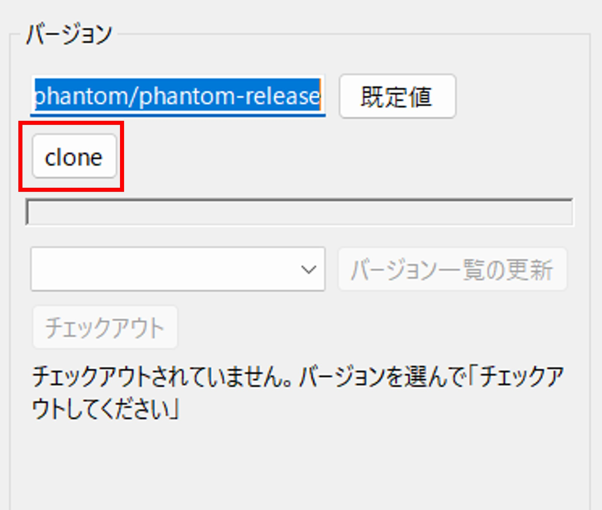

Cloneが完了するとバージョン一覧が現れます。2026/5/5時点の最新版 v1.0.36 を選択し、「チェックアウト」ボタンをクリックしてください。

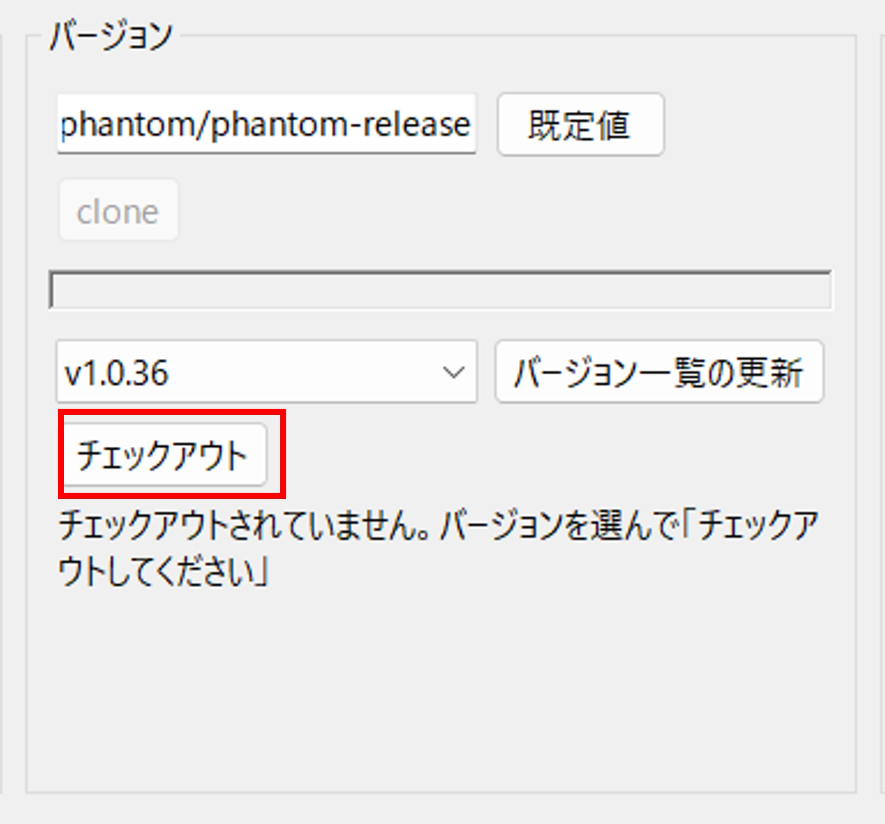

次のように表示されます。

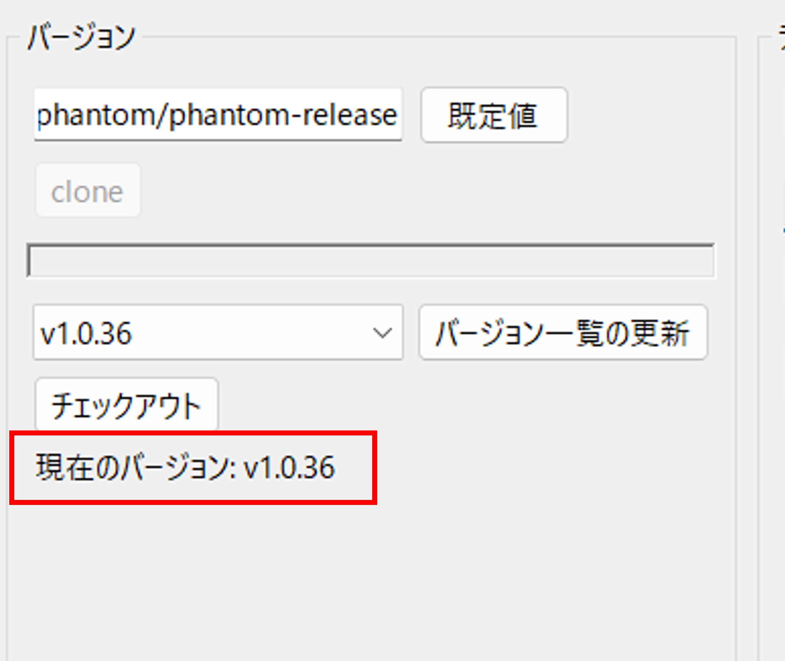

「.env保存」をクリックしてください。画面下のテキストに「.envを作成した」旨の表示がでます。
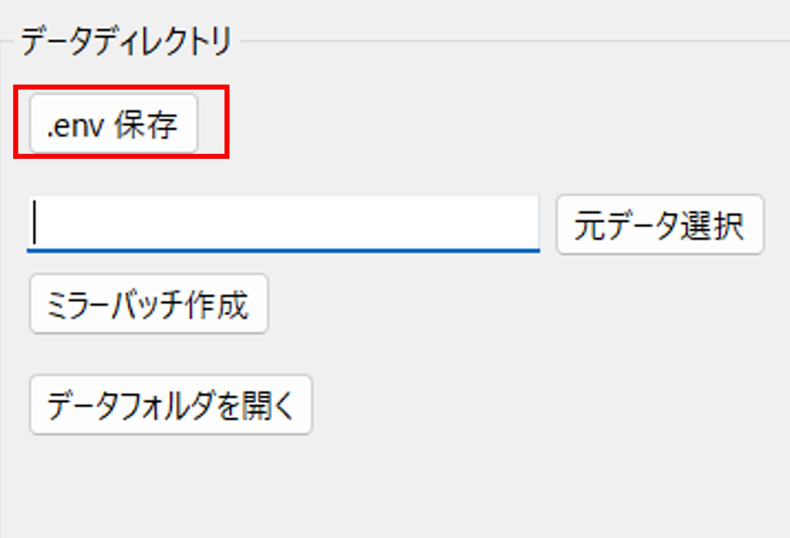

## 4. 取り込むデータの準備
インターネット出願ソフトのデータを本システムの所定のフォルダにコピーします。

手動か半自動でコピーできます。手動の場合は、4.1～4.2の手順に従ってください。半自動の場合は、4.3の手順に従ってください。

### 4.1 コピー先
「データフォルダを開く」をクリックするとコピー先のフォルダ「internet-app-data」が現れます。

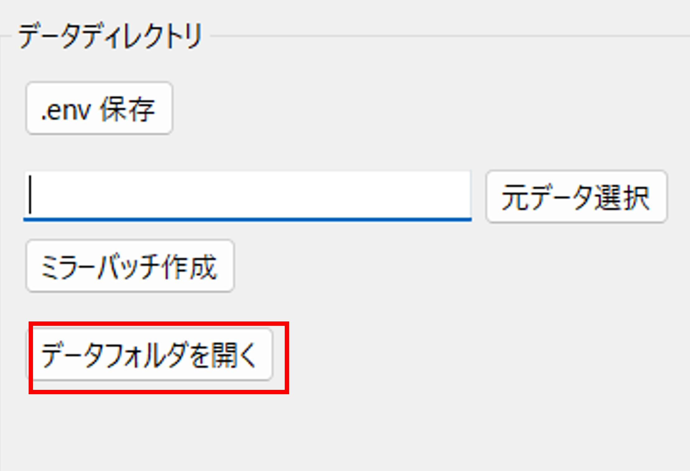

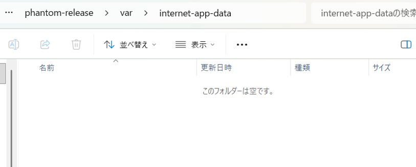

### 4.2 コピーするデータ
インターネット出願ソフトのデータは、通常、「CドライブのJPODATAフォルダ」に保存される。

APPL.JP1か、J05で終わるフォルダを適当に選んで「internet-app-data」にコピーしてください。

NOTICE.JP1 まるごとか、発送書類を受け取った日付のフォルダを適当に選んで「internet-app-data」にコピーしてください。

### 4.3 半自動でのコピー
「元データ選択」をクリックし、インターネット出願ソフトのデータが保存されているフォルダを指定します。ネットワークドライブでもOKです。

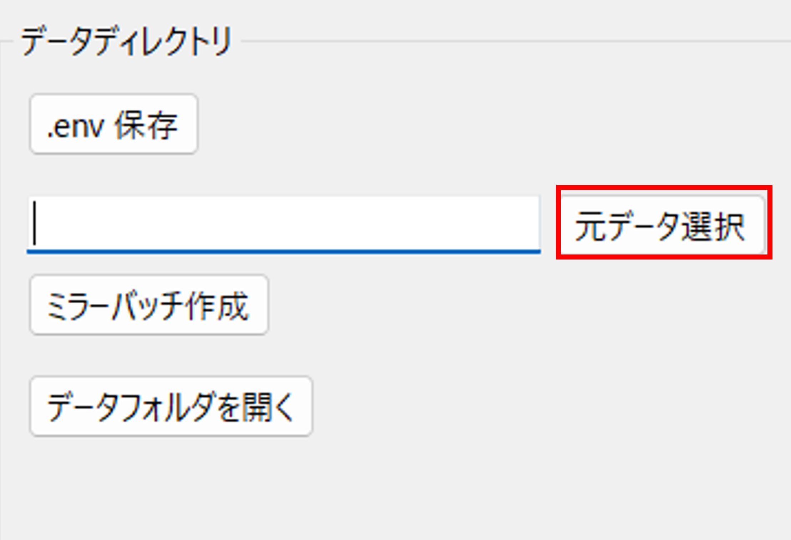

選択したフォルダが表示されていることを確認してください。「ミラーバッチ作成」をクリックします。

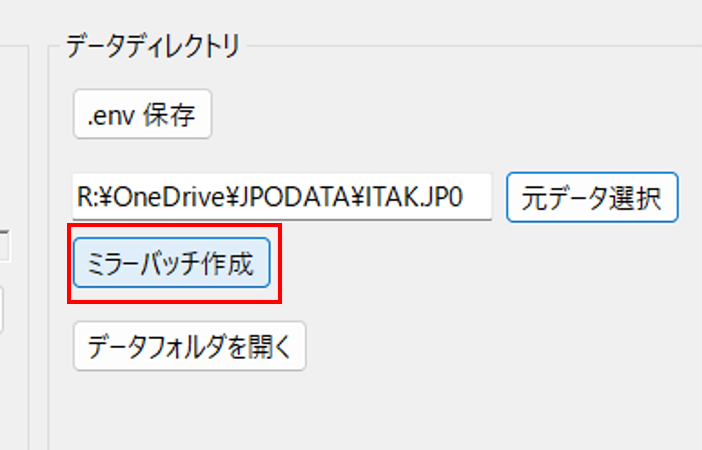

「bat」フォルダに、「mirror.bat」というファイルが生成されます。

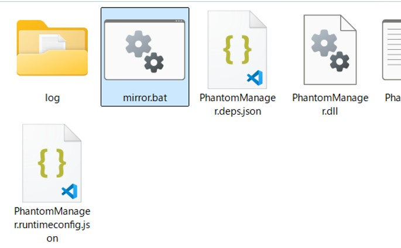

「mirror.bat」をダブルクリックして実行してください。これで、インターネット出願ソフトのデータが「internet-app-data」フォルダにコピーされます。

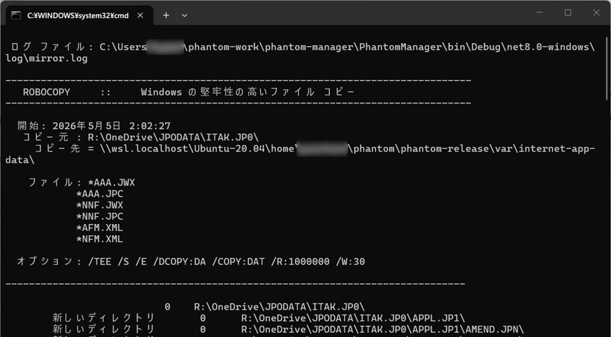

コピーが完了したら画面が消えます。

インターネット出願ソフトのデータが増えた場合でも「mirror.bat」を再度実行することで、最新のデータをコピーできます。

## 5. サーバー起動・停止
### 5.1 起動
全文検索システムのサーバーを起動します。
「起動」ボタンをクリックしてください。
初回はダウンロードに相当時間かかります。次のような画面になるまで待ってください。

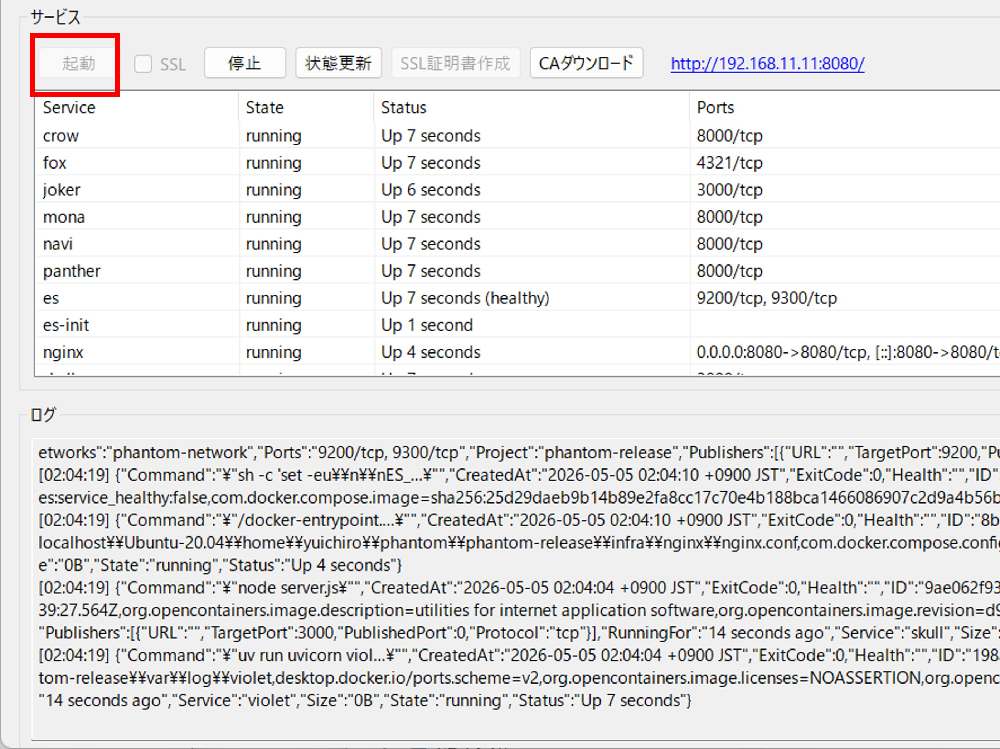

http://... のリンクをクリックすると、ブラウザで全文検索システムが表示されます。

### 5.3 停止
「停止」ボタンをクリックすると、サーバーが停止します。

## 6. 運用
ブラウザに「管理画面」が表示されます。「crow の管理画面へ」→「ALL」を選択して、「ジョブ開始」すると、「インターネット出願ソフトのデータ」フォルダにコピーしたデータがデータベースに取り込まれます。

適宜、↓を繰り返してください。
- インターネット出願ソフトのデータが増えたら、手動コピー or mirro.bat を実行
- crow ⇒ ALL ⇒ ジョブ開始

