# Phantom Manager インストール手順

このドキュメントは、Windows 上に全文検索システム phantom を構築するための手順です。
作業は上から順に一度だけ行えば終わります。

Phantom Manager は、**WSL2 の Ubuntu の中で動く小さな Web サーバ**です。
起動すると Windows のブラウザに管理画面が開き、そこから phantom の取得・設定・起動を行います。

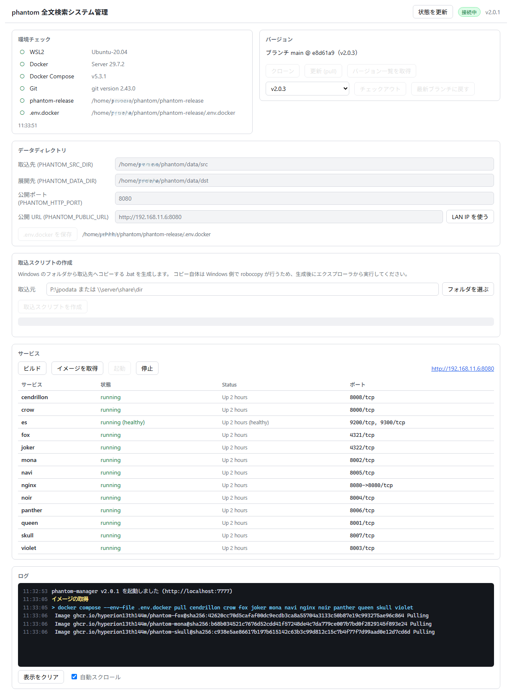

> 旧バージョンは Windows の `phantom-manager.exe` でした。新バージョンは WSL の中で動く
> 1 つの実行ファイルで、`wsl-install.bat` も ZIP の展開も必要ありません。
> 旧バージョンから移行する場合は [10. 旧バージョンからの移行](#10-旧バージョンからの移行) を先に読んでください。

## 目次

1. [必要な環境](#1-必要な環境)
2. [Phantom Manager の入手と起動](#2-phantom-manager-の入手と起動)
3. [環境チェック](#3-環境チェック)
4. [phantom 本体の取得（クローン）](#4-phantom-本体の取得クローン)
5. [データディレクトリの設定](#5-データディレクトリの設定)
6. [取り込むデータの準備](#6-取り込むデータの準備)
7. [サービスの起動・停止](#7-サービスの起動停止)
8. [ログ](#8-ログ)
9. [日々の運用](#9-日々の運用)
10. [旧バージョンからの移行](#10-旧バージョンからの移行)
11. [困ったときは](#11-困ったときは)

---

## 1. 必要な環境

- Windows 10 / 11
- WSL2（Ubuntu）
- Docker Desktop for Windows

メモリは **16GB 以上を推奨**します（最低 8GB）。
ディスクは、文書 1 件あたり数百 KB〜数 MB に加えて、検索インデックスとモデルの
キャッシュに数 GB を使います。取り込む件数から見積もってください。

### 1.1 WSL2 のインストール

スタートメニューで「PowerShell」を右クリックし、**管理者として実行**します。
次のコマンドを入力してください。

```powershell
wsl --install -d Ubuntu
```

インストールが終わったらパソコンを再起動します。
再起動後に Ubuntu のウィンドウが開き、**ユーザ名とパスワード**を聞かれるので入力してください。
ここで決めたユーザ名とパスワードは、あとで WSL にログインするときに使います。

> すでに WSL2 と Ubuntu が入っている場合は、この手順は不要です。
> `wsl -l -v` で `VERSION` が `2` になっていることだけ確認してください。

### 1.2 Docker Desktop のインストール

Docker Desktop をダウンロードしてインストールします。
配布元 [Docker Desktop for Windows](https://docs.docker.com/desktop/setup/install/windows-install/)

ダウンロードしたインストーラーをダブルクリックしてください。

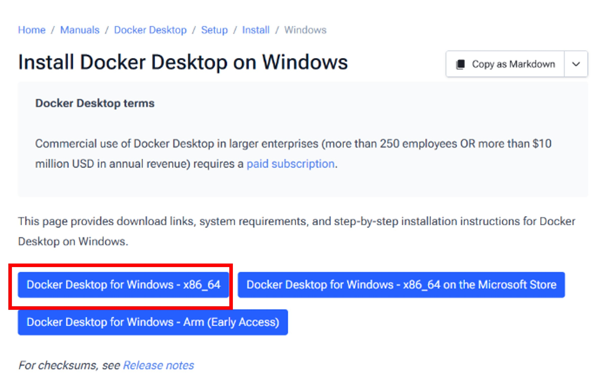

そのまま 「OK」

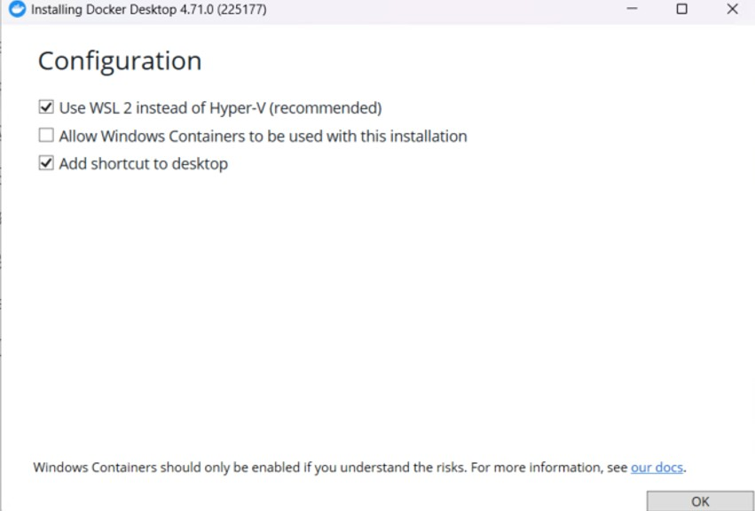

インストールが始まる

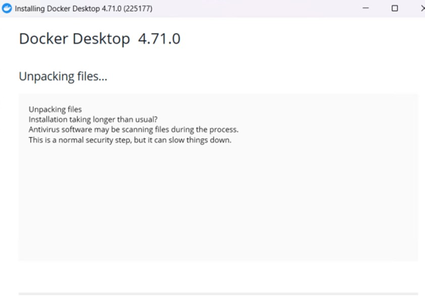

インストールが終わる。「Close and restart」をクリックしてパソコンを再起動する。

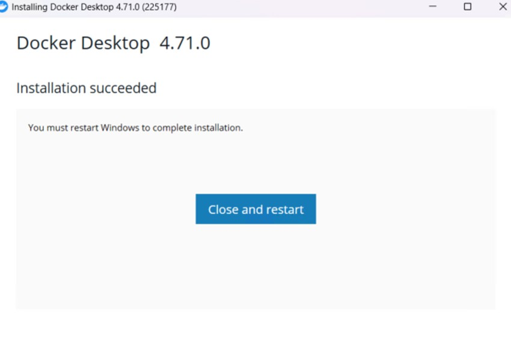

### 1.3 Docker Desktop の初期設定

デスクトップに Docker Desktop for Windows のアイコンがあるのでダブルクリックして起動する。

記載事項に承諾するなら「Accept」

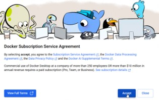

メールアドレスを登録するかgoogleなどのアカウントでサインイン、またはSkip

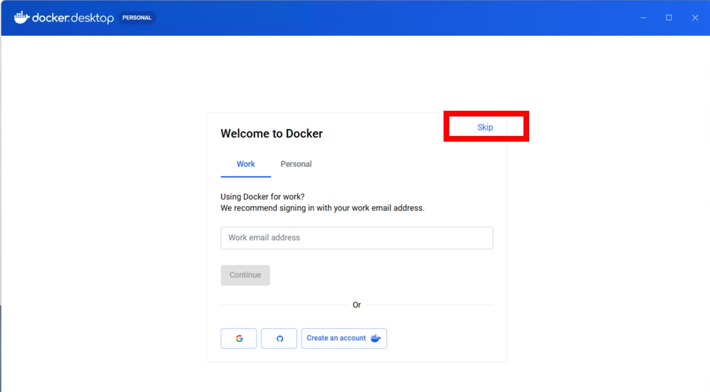

このような画面になれば初期設定完了

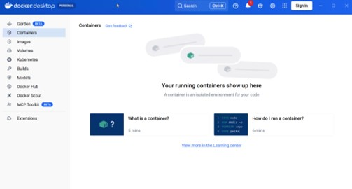

もし、「WSL needs updating」と表示されたら、「Try Again」をクリックする。

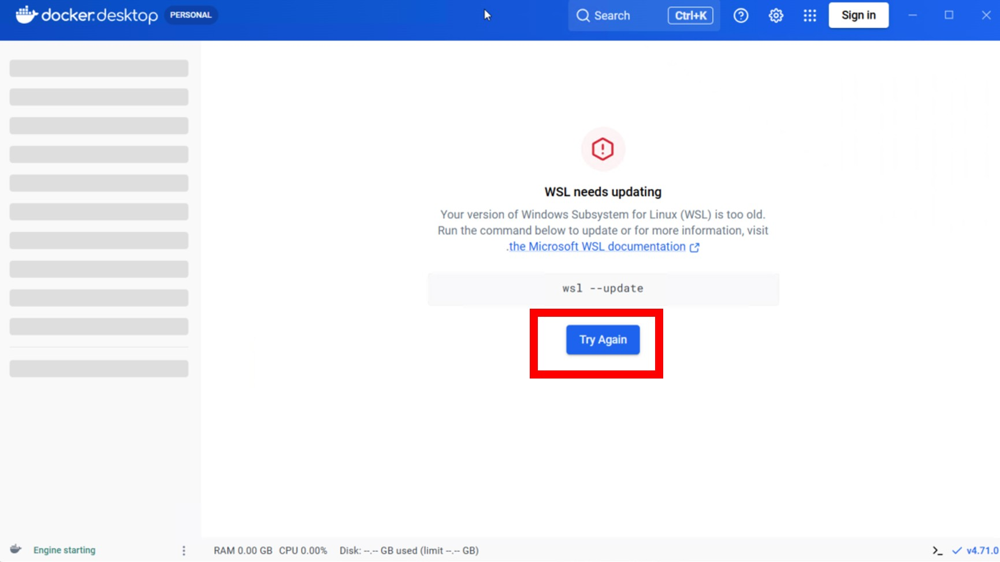

このような画面がでるので、Enterキーなど押す。

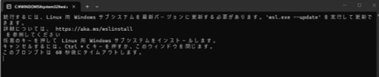

「はい」

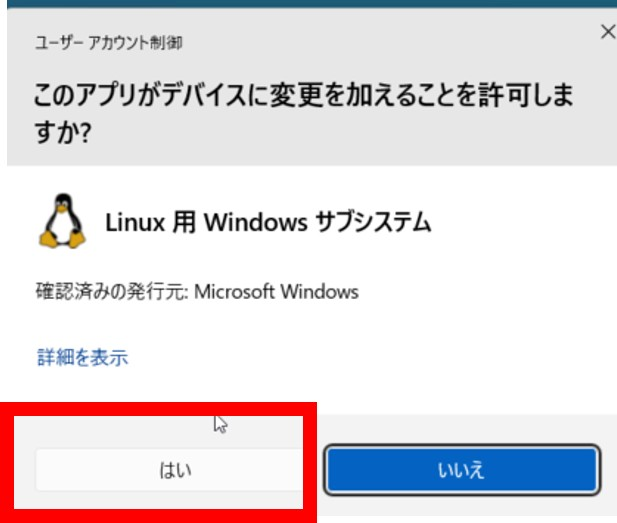

セットアップが始まる。このようになるまで待つ。

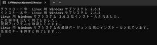

### 1.4 WSL 統合を有効にする（重要）

**この設定を忘れると、Ubuntu の中から Docker が使えません。**
新バージョンでいちばん多いつまずきどころです。

1. Docker Desktop の右上の歯車（Settings）を開く
2. **Resources** → **WSL Integration** を選ぶ
3. **Enable integration with additional distros** の一覧にある `Ubuntu` のスイッチをオンにする
4. **Apply & restart** をクリックする

設定できているかどうかは、あとの [3. 環境チェック](#3-環境チェック) で確認できます。

### 1.5 WSL2 にメモリを割り当てる（重要）

WSL2 は既定でパソコンの搭載メモリの半分しか使いません。
phantom は取り込み中に最大 9GB ほど使うため、**既定のままでは足りず、
途中で強制終了することがあります。**

メモ帳などで `C:\Users\<Windowsのユーザー名>\.wslconfig` というファイルを作り、
次の内容を書いて保存してください。

搭載 16GB のパソコンの場合（Windows 本体に 6GB 残す想定）:

```ini
[wsl2]
memory=10GB
processors=4
swap=8GB
```

搭載 32GB あるなら `memory=16GB` にしてください。

書いたら、管理者の PowerShell で次を実行して反映します。

```powershell
wsl --shutdown
```

そのあと Docker Desktop を再起動してください。

### 1.6 Git のインストール

スタートメニューから「Ubuntu」を起動し、次のコマンドを実行します。
パスワードは 1.1 で決めたものです。

```bash
sudo apt update && sudo apt install -y git
```

---

## 2. Phantom Manager の入手と起動

以降の作業はすべて **Ubuntu のウィンドウ**（WSL）で行います。

### 2.1 ダウンロード

```bash
curl -fsSL -o phantom-manager https://github.com/hyperion13th144m/phantom-manager/releases/latest/download/phantom-manager && chmod +x phantom-manager
```

ホームディレクトリに `phantom-manager` という 1 つのファイルができます。
これだけで動きます。インストール作業や、別途のランタイムの導入は必要ありません。

### 2.2 起動

```bash
./phantom-manager
```

Windows の既定のブラウザが開き、管理画面 `http://localhost:7777` が表示されます。
自動で開かないときは、ブラウザのアドレス欄に `http://localhost:7777` と手で入力してください。

Ubuntu のウィンドウには次のように表示されます。このウィンドウは**閉じないでください**。
閉じると管理画面も止まります。

```
phantom-manager v2.0.1
  http://localhost:7777 をブラウザで開いてください
```

管理画面を閉じてよいときは、Ubuntu のウィンドウで `Ctrl+C` を押して終了します。
phantom 本体（サービス）は Docker の中で動き続けるので、管理画面を閉じても検索は止まりません。

> **2 回目以降も同じです。** Ubuntu を起動して `./phantom-manager` と入力するだけです。

---

## 3. 環境チェック

管理画面の左上「環境チェック」で、パソコンの準備ができているかを確認します。
バージョン番号は違っていて構いません。

まず、上の 4 項目 **WSL2 / Docker / Docker Compose / Git** に ○ が付いていることを確認してください。
この 4 つが揃っていれば先に進めます。

`phantom-release` と `.env.docker` は、この時点では「—」（未設定）です。
これから [4](#4-phantom-本体の取得クローン)・[5](#5-データディレクトリの設定) で作るので、問題ありません。
すべて済むと、次のように 6 項目すべてが ○ になります。

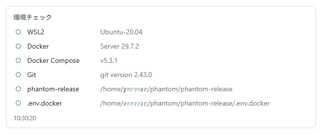

✕ が付いた場合は、その下に対処方法が表示されます。

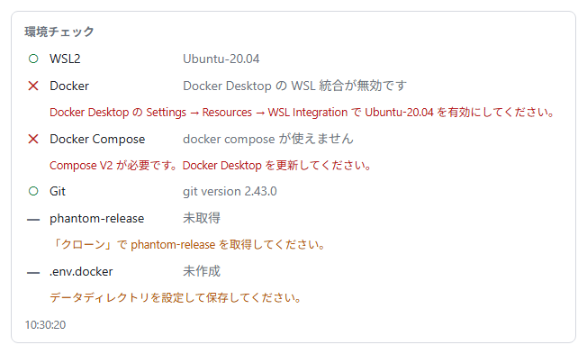

| 表示 | 対処 |
|---|---|
| Docker：`docker コマンドが見つかりません` | [1.2](#12-docker-desktop-のインストール) の Docker Desktop がインストールされていません |
| Docker：`Docker Desktop の WSL 統合が無効です` | [1.4](#14-wsl-統合を有効にする重要) の設定を行ってください |
| Docker：上記以外 | Docker Desktop が起動しているか確認してください（タスクトレイのクジラのアイコン） |
| Git：`git コマンドが見つかりません` | [1.6](#16-git-のインストール) を行ってください |
| WSL2：`WSL 環境ではありません` | Windows の PowerShell などで実行しています。Ubuntu のウィンドウで実行してください |

対処したら、画面右上の「状態を更新」を押すと再チェックされます。

---

## 4. phantom 本体の取得（クローン）

「バージョン」の枠で、phantom 本体をインターネットから取得します。


「クローン」をクリックしてください。数分かかります。
完了すると、取得したバージョンが表示されます。

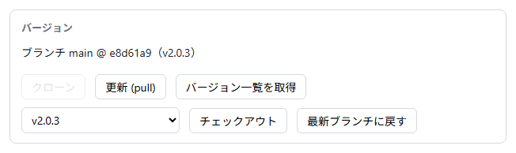

- 通常は**この状態のまま**（最新のブランチ）で構いません。
- 特定のバージョンに固定したいときは、「バージョン一覧を取得」を押してから
  一覧でバージョンを選び、「チェックアウト」をクリックします。
- 固定をやめるときは「最新ブランチに戻す」をクリックします。
- 新しいバージョンが出たときは「更新 (pull)」をクリックします。

---

## 5. データディレクトリの設定

phantom がデータを置く場所を決め、設定ファイル `.env.docker` を作ります。

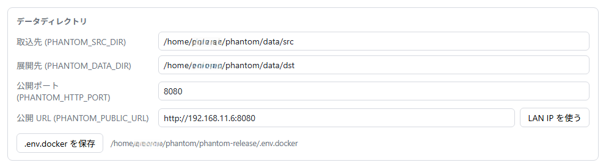

| 項目 | 内容 |
|---|---|
| 取込先 (PHANTOM_SRC_DIR) | インターネット出願ソフトのデータをコピーしてくる場所 |
| 展開先 (PHANTOM_DATA_DIR) | phantom が変換したデータを置く場所。容量を最も使います |
| 公開ポート (PHANTOM_HTTP_PORT) | 検索画面のポート番号 |
| 公開 URL (PHANTOM_PUBLIC_URL) | ブラウザから見た検索画面のアドレス |

**このパソコンだけで使う場合は、初期値のままで構いません。**「.env.docker を保存」をクリックしてください。

**他のパソコンからも検索したい場合**は、「LAN IP を使う」をクリックしてから
「.env.docker を保存」をクリックします。公開 URL がこのパソコンのアドレス
（`http://192.168.x.x:8080` など）に書き換わり、他のパソコンのブラウザからも開けるようになります。

保存すると、取込先と展開先のフォルダが自動で作られます。

> サービスが起動している間は、この枠は灰色になって編集できません。
> 変更したいときは、先に [7.2 停止](#72-停止) を行ってください。

### 5.1 メモリの割り当てについて（自動）

`.env.docker` を初めて作るとき、検索エンジン（Elasticsearch）の使用メモリが
**[1.5](#15-wsl2-にメモリを割り当てる重要) の割り当て（WSL2 に 10GB）に合わせて**自動で設定されます。
画面での操作は必要ありません。

```ini
ES_JAVA_OPTS=-Xms1g -Xmx1g
ES_MEM_LIMIT=2g
```

この設定なしでは、取り込みの途中（画像を解析する violet がモデルを読む場面）で
メモリが足りなくなり、処理が強制終了します。

**WSL2 により多くのメモリを割り当てた場合**は、`.env.docker` をテキストエディタで開いて
この 2 行を書き換えてください。書き換えた値は、次に「.env.docker を保存」を押しても
上書きされません。元の値は 1 行上にコメントとして残してあります。

---

## 6. 取り込むデータの準備

インターネット出願ソフトのデータを、5 で決めた**取込先**にコピーします。
コピーには、管理画面が作る `mirror.bat` を使います。

### 6.1 インターネット出願ソフトのデータ

インターネット出願ソフトのデータは、通常、Cドライブの `JPODATA` フォルダに保存されています。

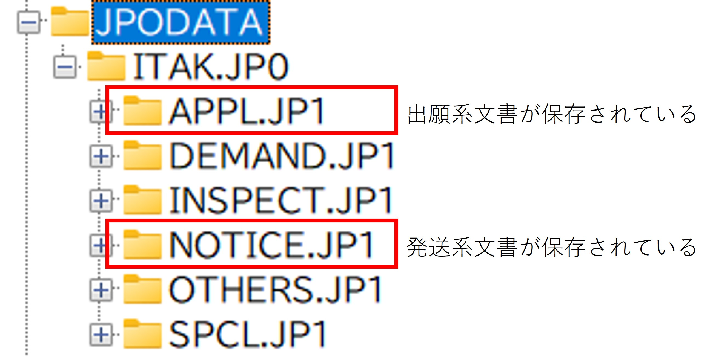

出願系のファイル（`APPL.JP1` や `J05` で終わるフォルダ）

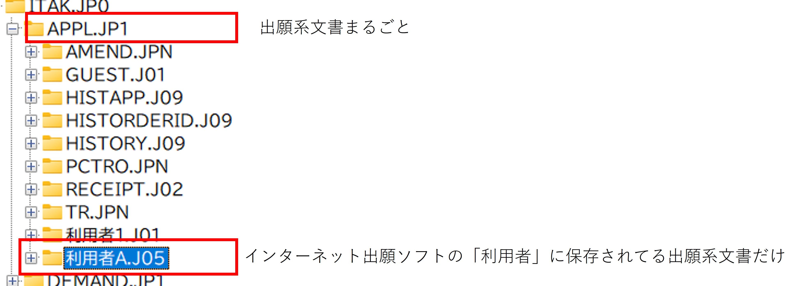

発送系のファイル（`NOTICE.JP1`）

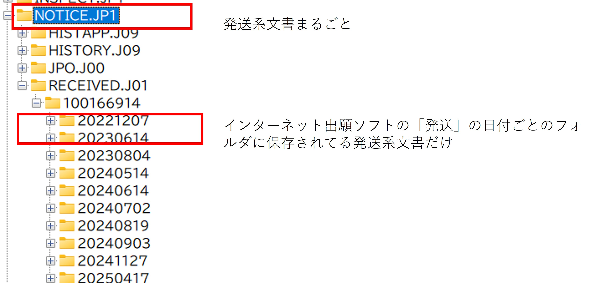

これらが入っているフォルダを、次の手順で指定します。
ネットワークドライブ（`P:` などの割り当てドライブや `\\server\share`）でも構いません。

### 6.2 取込スクリプトの作成

「取込元」の欄に、上のデータが入っているフォルダを入力します。
「フォルダを選ぶ」をクリックすると、ドライブから順にたどって選べます。

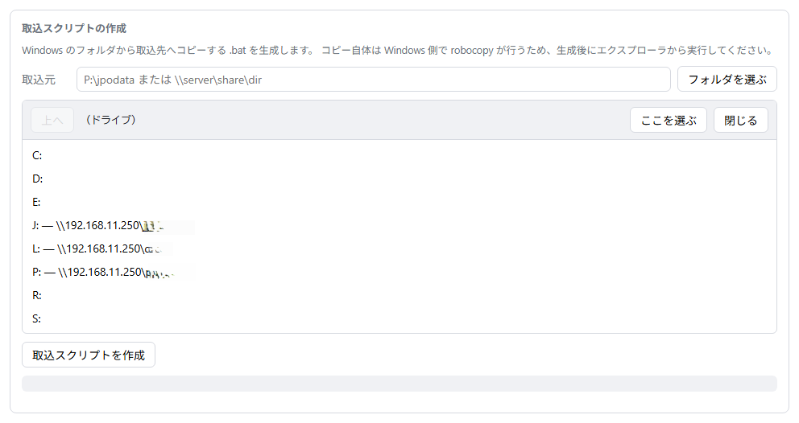

目的のフォルダまで移動したら「ここを選ぶ」をクリックします。
そのあと「取込スクリプトを作成」をクリックしてください。

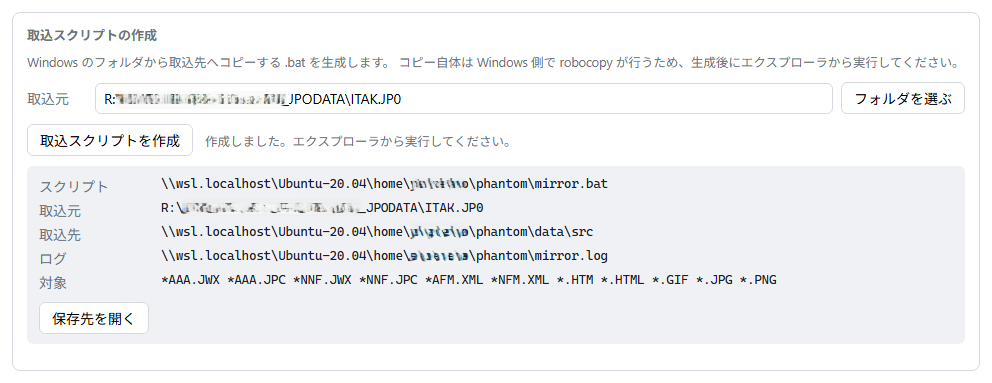

`mirror.bat` が作られ、コピー元・コピー先・対象ファイルが表示されます。
コピーされるのは、電子データと、XML が残っていない文書の HTML・画像だけです。

### 6.3 取込スクリプトの実行

「保存先を開く」をクリックすると、Windows のエクスプローラで `mirror.bat` のある場所が開きます。
**`mirror.bat` をダブルクリックして実行してください。**

黒い画面が開いてコピーが始まります。データ量によっては時間がかかります。
「コピーが完了しました。」と表示されたら、何かキーを押して閉じてください。

> **なぜバッチファイルなのか。** コピーは Windows 側の robocopy が行います。
> WSL からネットワーク越しに数万個のファイルを読むと実用的な速度が出ないためです。

インターネット出願ソフトのデータが増えたときは、**`mirror.bat` をもう一度ダブルクリックするだけ**です。
差分だけがコピーされます。管理画面を開き直す必要はありません。

---

## 7. サービスの起動・停止

### 7.1 起動

「サービス」の枠で、**上から順に**クリックします。

1. **ビルド** — 検索エンジン（Elasticsearch）のイメージを組み立てます
2. **イメージを取得** — phantom の各サービスをダウンロードします
3. **起動** — サービスを立ち上げます

**初回は 1 と 2 に相当な時間がかかります**（回線によっては 1 時間以上）。
ログが流れている間は正常です。そのまま待ってください。

すべてのサービスが `running` になれば完了です。

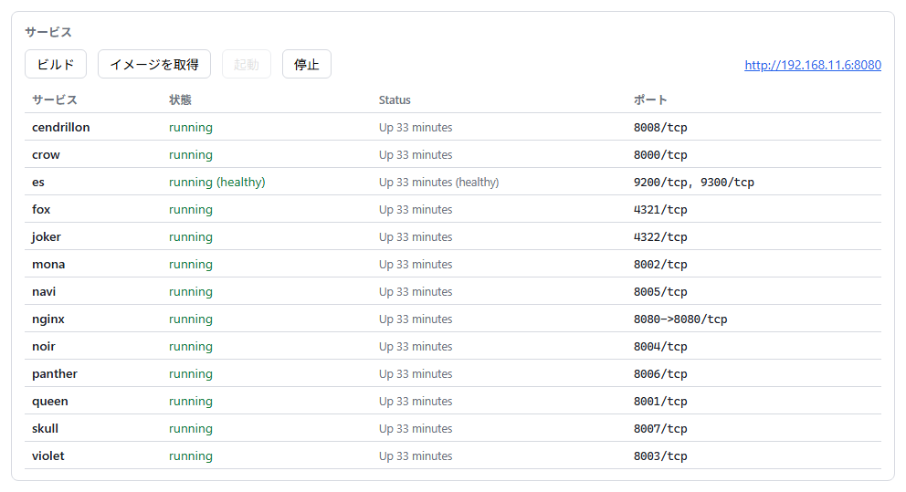

右上に表示される URL をクリックすると、ブラウザで検索画面が開きます。

> `es`（Elasticsearch）だけは `running (healthy)` になるまで少し時間がかかります。
> 起動直後に検索画面がエラーになるときは、1〜2 分待ってから開き直してください。

2 回目以降は「起動」だけで立ち上がります。
phantom のバージョンを上げたときだけ、もう一度「ビルド」「イメージを取得」を行ってください。

### 7.2 停止

「停止」をクリックするとサービスが止まります。

**パソコンを再起動しても、Docker Desktop が立ち上がればサービスは自動で復帰します。**
管理画面を開き直す必要はありません。
自動で戻らないときだけ `./phantom-manager` を起動して「起動」をクリックしてください。

---

## 8. ログ

管理画面が実行したコマンドと、その出力はすべて「ログ」の枠に流れます。

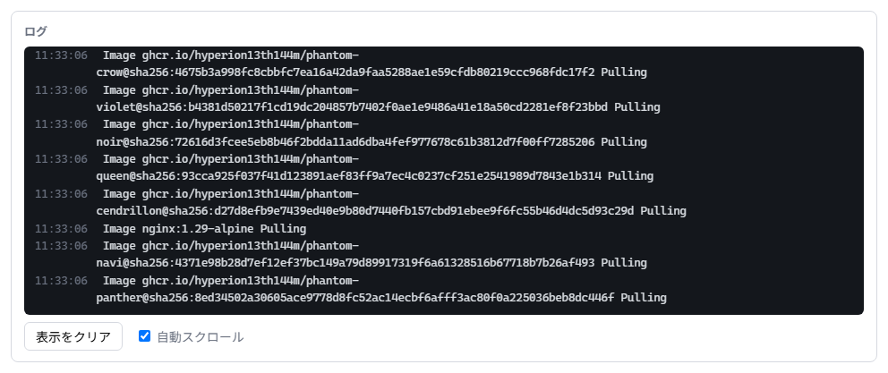

うまくいかないときは、この内容をそのままコピーして問い合わせてください。原因が追えます。

色には意味があります。

| 色 | 意味 |
|---|---|
| 黄色 | 処理の開始 |
| 水色 | 実行したコマンド |
| 白 | 処理の進行状況（`Pulling`、`Started` など） |
| **赤** | **エラー** |
| 緑 | 処理の完了 |

緑色の「〜が完了しました」が出ていれば成功です。
赤い行が出たときは、その内容を添えて問い合わせてください。

---

## 9. 日々の運用

ここから先は phantom 本体の操作です。検索画面のアドレス（[5](#5-データディレクトリの設定) で決めた公開 URL）を開いてください。

新しいデータを取り込むときは、次を繰り返します。

1. `mirror.bat` をダブルクリックする（[6.3](#63-取込スクリプトの実行)）
2. 検索画面の `/navi/`（パイプライン管制）を開き、**「パイプライン開始」**をクリックする
3. 取り込みが終わると、検索できるようになります

整理番号・タグ・担当者を登録するときは `/skull/` を開き、登録後に「同期開始」をクリックします。

詳しくは、取得した phantom 本体の `docs/operations.md` を参照してください。
`~/phantom/phantom-release/docs/operations.md` にあります。

---

## 10. 旧バージョンからの移行

旧バージョン（Windows の `phantom-manager.exe`）を使っていた場合の注意点です。

- **`wsl-install.bat` は不要になりました。** 新バージョンは WSL の中で動きます。
- **`.exe` と ZIP は配布されなくなりました。** [2.1](#21-ダウンロード) の実行ファイル 1 つに変わりました。
- **設定ファイルが `.env` から `.env.docker` に変わりました。**
  古い `.env` は読まれません。[5](#5-データディレクトリの設定) で作り直してください。
- **データの置き場所が変わりました。** 旧バージョンはリポジトリの中の `internet-app-data` に
  コピーしていましたが、新バージョンは `~/phantom/data/src`（[5](#5-データディレクトリの設定) の取込先）です。
  取込スクリプトを作り直せば、新しい場所にコピーされます。
- 旧バージョンで `~/phantom/phantom-release` に取得済みの場合は、そのまま引き継がれます。
  「更新 (pull)」で最新にしてください。

旧バージョンの実行ファイルとフォルダは、動作を確認したあと削除して構いません。

---

## 11. 困ったときは

| 症状 | 対処 |
|---|---|
| ブラウザが自動で開かない | `http://localhost:7777` を手で入力してください |
| `localhost:7777` につながらない | Ubuntu のウィンドウで `./phantom-manager` が動いたままか確認してください |
| ポート 7777 が使用中と表示される | 別の番号で起動します。Ubuntu の画面に出た URL を開いてください |
| ボタンが灰色で押せない | マウスを乗せると理由が表示されます。多くは「サービスを停止してから操作してください」です |
| 検索画面が他のパソコンから開けない | [5](#5-データディレクトリの設定) で「LAN IP を使う」を押して保存し直してください。Windows のファイアウォールも確認してください |
| 「フォルダを読み込めませんでした」と出る | ネットワークドライブが切断されている可能性があります。エクスプローラで開けるか確認してください |
| データを増やしたのに検索に出てこない | `mirror.bat` の実行と、`/navi/` の「パイプライン開始」の両方が必要です（[9](#9-日々の運用)） |

上記で解決しない場合は、[8. ログ](#8-ログ) の内容を添えて問い合わせてください。
